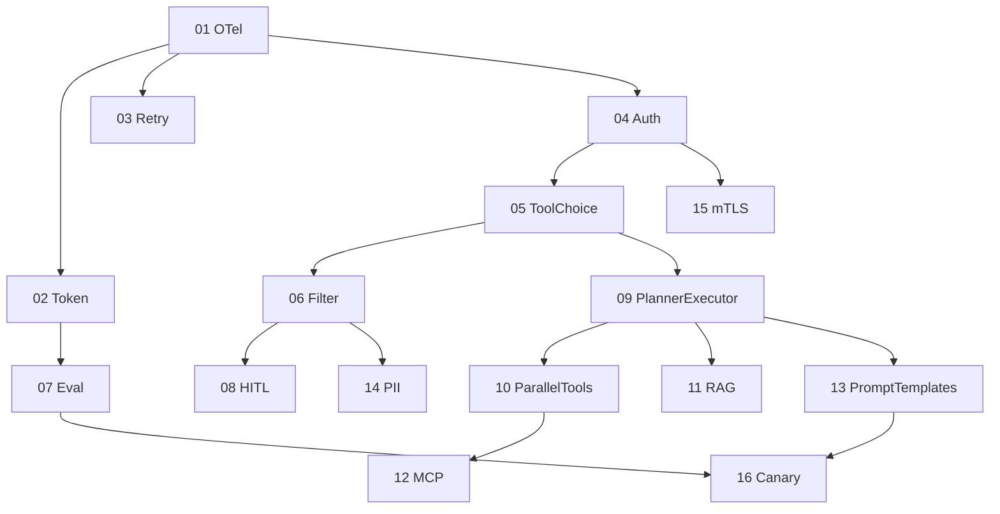

# 00. プロダクション品質強化ロードマップ概要

## 1. 背景

go-llm-agent は LLM ゲートウェイとローカルエージェントを単一バイナリで提供します。書籍「Building Applications with AI Agents（Michael Albada, O'Reilly, 2025）」が示す本番運用の要件と現状実装を突合した結果、16 項目の不足点を確認しました。本書はそれらを実装順に並べたロードマップ兼メタ設計書です。

本ロードマップでは Ch6 のうち Working Memory（自動要約）と Semantic Memory（ノート全文検索）のみを 11 番でカバーします。Episodic Memory（過去 session のエピソードを横断保持する仕組み）と Procedural Memory（ツール選択の学習）は本ロードマップの対象外とし、ベクター DB 依存が必要な段階で将来フェーズに先送りします。Ch7 のファインチューニング系学習も同様にスコープ外です。

## 2. 優先度の決定原則

優先度は次の三軸で評価します。

1. 観測性と安全装置は他機能のテストの土台になるため最優先で導入します。
2. リトライ、認証、スキーマ検証は誤動作の影響を最小化するため早期に入れます。
3. 評価フレームワーク、HITL、RAG、戦略拡張、外部統合の順に進めます。

## 3. 実装順序

| 順番 | 設計書 | 区分 | 主目的 |
| --- | --- | --- | --- |
| 01 | 01-otel-instrumentation.md | S | 分散トレースとメトリクス計装 |
| 02 | 02-token-cost-tracking.md | S | トークン使用量とコストの集計 |
| 03 | 03-llm-retry-backoff.md | S | LLM 呼び出しのリトライとタイムアウト |
| 04 | 04-http-auth-ratelimit.md | S | HTTP API の Bearer 認証とレート制限 |
| 05 | 05-tool-choice-schema-validation.md | S | tool_choice と JSON スキーマ強制 |
| 06 | 06-input-output-filter.md | S | プロンプトインジェクション検知と出力フィルタ |
| 07 | 07-eval-framework.md | A | 評価フレームワーク CLI |
| 08 | 08-hitl-approval.md | A | ツール実行承認とエスカレーション |
| 09 | 09-planner-executor.md | A | Planner-Executor 戦略 |
| 10 | 10-parallel-tool-calls.md | A | 並列ツール実行 |
| 11 | 11-rag-mvp.md | A | 短期要約とノート全文検索 |
| 12 | 12-mcp-client.md | B | MCP クライアントによる動的ツール発見 |
| 13 | 13-prompt-template-versioning.md | B | プロンプトテンプレートの版管理 |
| 14 | 14-pii-redaction.md | B | 出力 PII 自動マスキング |
| 15 | 15-mtls-oauth.md | B | mTLS と OAuth2 リソースサーバ |
| 16 | 16-canary-shadow.md | B | カナリアおよびシャドウデプロイ |

## 4. 共通の作業規約

全項目に次のルールを適用します。

### 4.1 コミット規約

- ブランチは `feature/production-hardening` を共通の起点にします。
- コミットは 1 設計書に対して 1 機能、1 リファクタを基本とします。
- コミットメッセージは `feat(<scope>):` 形式とし、書籍の章番号を本文に明記します。

### 4.2 TDD 規約

- 各設計書の実装タスクは RED、GREEN、REFACTOR の 3 フェーズに分割します。
- カバレッジ目標は対象パッケージ単位で 80 パーセント以上とします。`go test -cover ./internal/<pkg>/...` で確認します。
- 副作用を持つコード（ファイル I/O、HTTP、外部 API）はインターフェース越しにテストできる形に保ちます。

### 4.3 E2E 規約

- E2E スクリプトは `tests/e2e/<NN>-<short-name>.sh` に保存します。
- 各スクリプトは Go と bash のみで動作し、ローカル PC 固有のパスやアカウントに依存しません。
- 既存の `scripts/verify-hardening.sh` と同様に `set -euo pipefail` を冒頭で宣言します。この要件は全 E2E スクリプトに共通とし、各設計書の 7.3 節での再記載は省略します。
- 各 E2E スクリプトの先頭に `# Conforms to docs/design/00-overview.md section 4.3` というコメントを必ず入れ、参照関係を明示します。

### 4.4 リリースビルド規約

- 各設計書の最後で `go build -o bin/agent ./cmd/agent` を実行し、サブコマンドの smoke を CI のクオリティゲートに加えます。
- 既存の `scripts/quality-gate.sh` を更新し、新規パッケージのテストとリンタが通ることを確認します。

### 4.5 ドキュメント規約

- 機能ごとに `README.md` の該当節を更新します。
- 設定例は `config.yaml.example` にも追記します。
- 既存の `docs/usage.md` のサブコマンド表に新規 CLI を追加します。

## 5. 依存関係グラフ

## 6. 完了基準

ロードマップ全体が完了したと見なすには次の条件をすべて満たします。

- 16 個の設計書が個別にレビュー済みで指摘ゼロです。
- 16 機能が個別にコミットされ、`scripts/quality-gate.sh` がグリーンです。
- 各機能の E2E スクリプトが `tests/e2e/` に存在し手元で再現可能です。
- `bin/agent` が `version`、`config`、`tools`、`run`、`serve`、`chat`、`eval` の各サブコマンドで動作します。
- `README.md` の Security 節および Observability 節が新規機能に追従しています。
